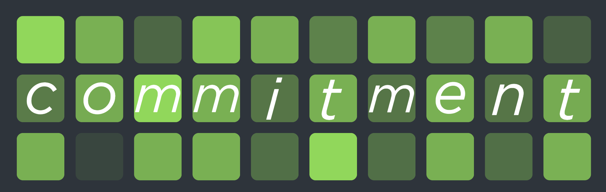
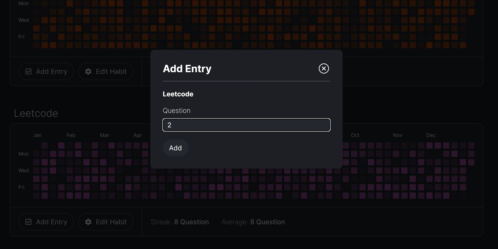

# commitment 

## About :information_source:

Commit to your personal goals through the familiar github commits tracker interface! Commitment is a fully customizable daily habit tracker web-app that displays your progress as a commits grid. You can add your own habits, stylize them, and start logging your progress everyday.

## Built With :wrench: 

      

## How to  :pushpin:

Start by clicking the 'Create New Habit' button at the top. Fill in the habits name, type and the daily units you want to track.

You can then add in yoour daily enteries to your specific habits by clicking the 'Add Entry' button and filling in the value. 

